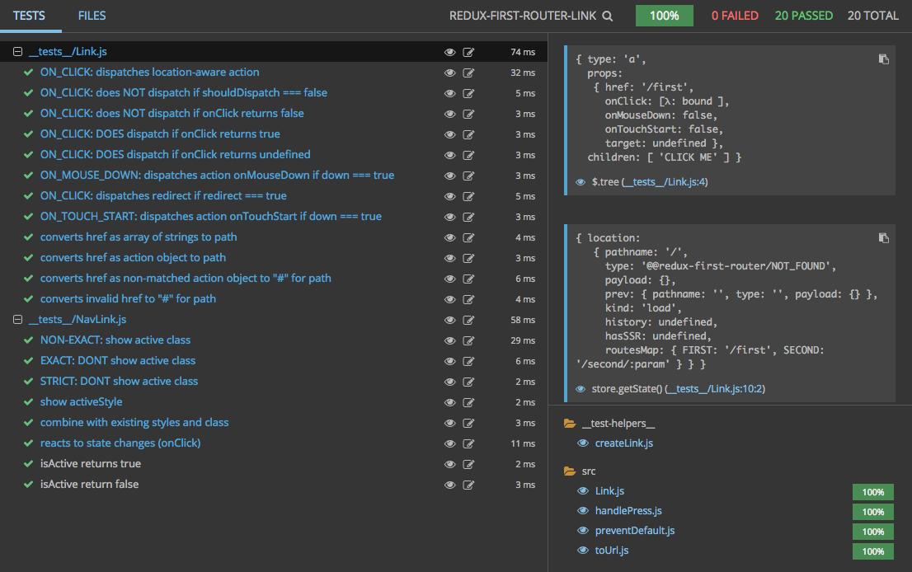

# redux-first-router-link

<p align="center">
  <a href="https://www.npmjs.com/package/redux-first-router-link">
    
  </a>

  <a href="https://travis-ci.org/faceyspacey/redux-first-router-link">
    
  </a>

  <a href="https://lima.codeclimate.com/github/faceyspacey/redux-first-router-link/coverage">
    
  </a>

  <a href="https://greenkeeper.io">
    
  </a>

  <a href="https://lima.codeclimate.com/github/faceyspacey/redux-first-router-link">
    
  </a>

  <a href="https://www.npmjs.com/package/redux-first-router-link">
    
  </a>
  
  <a href="https://snyk.io/test/github/faceyspacey/redux-first-router-link">
    
  </a>

  <a href="https://www.npmjs.com/package/redux-first-router">
    
  </a>
</p>

## Installation
```bash
yarn add redux-first-router-link
```

## Usage

```javascript
import Link from 'redux-first-router-link'

// as a standard href path string:
<Link to='/list/db-graphql'>DB & GRAPHQL</Link>

// as an array of path segments:
<Link to={['list', 'react-redux']}>REACT & REDUX</Link>

// as an action object (RECOMMENDED APPROACH SO YOU CAN CHANGE ALL URLs FROM YOUR ROUTESMAP):
<Link to={{ type: 'LIST', payload: { category: 'fp' } }}>FP</Link>
```

In all **3 cases**, a simple link will be rendered, eg:

```javascript
<a to='/list/fp'>FP</a>
````

*NavLink:*
```javascript
import { NavLink } from 'redux-first-router-link'

<NavLink
  to={{ type: 'LIST', payload: { category: 'redux-first-router' } }}
  activeClassName='active'
  activeStyle={{ color: 'purple' }}
  exact={true}
  strict={true}
  isActive={(match, location) => location.payload.category === 'redux-first-router'}
>
  Redux First Router
</NavLink>
```
> NOTE: both `<Link />` and `<NavLink />` share the React Router API for easy use for those coming from there. Our components are a subset of React Router's Link component props API as there are several additional props. See below.


## Recommendation

Creating your links using an `action` object is obviously the best solution, as it will allow you to change
static path segments in the `routesMap` you pass to `connectRoutes()` at any time, without
having to change any of your `<Link />` components. That means you only have to change URLs in one place. AKA, your `routesMap` is your *"single source of truth."*

For example, if you have:

```javascript
import { createStore, compose, applyMiddleware, combineReducers } from 'redux'
import createBrowserHistory from 'history/createBrowserHistory'
import connectRoutes from 'redux-first-router'

const history = createBrowserHistory()

const { enhancer, middleware, reducer } = connectRoutes(history, {
  LIST: '/list/:category'
})

const rootReducer = combineReducers({ location: reducer })
const store = createStore(rootReducer, compose(enhancer, applyMiddleware(middleware)))
```

Then you can change the static segment of the path at any time, eg:
```javascript
const { middleware, enhancer, reducer } = connectRoutes(history, {
  LIST: '/browse/:category'
})
```

But its entirely up to you. If it's easier to start to thinking in terms of paths, go for it! If that's the case, we recommend the 
array syntax, since its easier to pass variables, eg:

```javascript
const category = 'react-redux'
const to = ['list', category]
<Link to={to}>REACT & REDUX</Link>
```
vs

```javascript
const category = 'react-redux'
const to = `/list/${category}` // can get long & yucky with lots of variables
<Link to={to}>REACT & REDUX</Link>
```


## Additional Props:
* **down: boolean = false** - if `true` supplied, will trigger linking/dispatching `onMouseDown` instead of `onMouseUp`.
* **shouldDispatch: boolean = true** - if `false` will not dispatch (useful for SEO when action handled in a parent or child element in a fancy way)
* **target: string** - eg: `'_blank'` to open up URL in a new tab (same as standard `target` attribute to `<a>` tags)
* **...props:** - you can pass any additional props that an `<a>` tag takes, such as `className` and `style`.

## Familiar React Router Props:
* **redirect: boolean = false** - if `true` supplied, will dispatching your action as a redirect, resulting in the current page in the browser history being replaced rather than pushed. That means if the user presses the browser BACK button, he/she won't be able to go back to the previous page that had the link--he/she will go to the page before that. *alias: replace*
* **onClick: (SyntheticEvent) => ?boolean** - you can provide an `onClick` handler to do anything you want (e.g. play a sound), but if you return `false` or call `event.preventDefault()` it will prevent
  linking/dispatching just as you may be used to. TIP: use either instead of `shouldDispatch` when you want to dynamically determine
  whether to trigger the action or not!

## React Router `NavLink`-only Props
* **activeClassName: string** - the class applied when the URL and `to` path match
* **activeStyle: object** - the style object applied when the URL and `to` path match 
* **exact: boolean = false** - if `true` supplied, active class/styles will not be applied in this example: URL is `/foo/bar` and link `to` is `/foo`. Whereas by default they would match.
* **strict: boolean = false** - if there is a trailing slash in the `to` path or URL, they both must have the slash to match. If there is no slash, they must both have *no* slash.
* **isActive: (match, location) => boolean** - a custom function to determine whether the link is active. Return `true` if active. The `match` argument is identical to React Router and not very useful. The `location` is `state.location`.

## Final Notes
* In previous versions the `to` prop was named `href` and the `onClick` prop was name `onPress`. Those still work, but they are identical to their new names. They will be removed eventually. 

* `redirect` has `replace` as an *alias* for easy migration from React Router, but the terminology in our system is `redirect`. You won't here the word `replace` much, even though that's what happens to the browser history. The reason is because server-side redirects is central to the problem solved as well, not just client-side history replacement. In general, it's a more descriptive term for how the system responds to it.

## Contributing


We use [commitizen](https://github.com/commitizen/cz-cli), so run `npm run cm` to make commits. A command-line form will appear, requiring you answer a few questions to automatically produce a nicely formatted commit. Releases, semantic version numbers, tags, changelogs and publishing to NPM will automatically be handled based on these commits thanks to [semantic-release](https://github.com/semantic-release/semantic-release). Be good.


## Tests

Reviewing a package's tests are a great way to get familiar with it. It's direct insight into the capabilities of the given package (if the tests are thorough). What's even better is a screenshot of the tests neatly organized and grouped (you know the whole "a picture says a thousand words" thing). 

Below is a screenshot of this module's tests running in [Wallaby](https://wallabyjs.com) *("An Integrated Continuous Testing Tool for JavaScript")* which everyone in the React community should be using. It's fantastic and has taken my entire workflow to the next level. It re-runs your tests on every change along with comprehensive logging, bi-directional linking to your IDE, in-line code coverage indicators, **and even snapshot comparisons + updates for Jest!** I requestsed that feature by the way :). It's basically a substitute for live-coding that inspires you to test along your journey.




